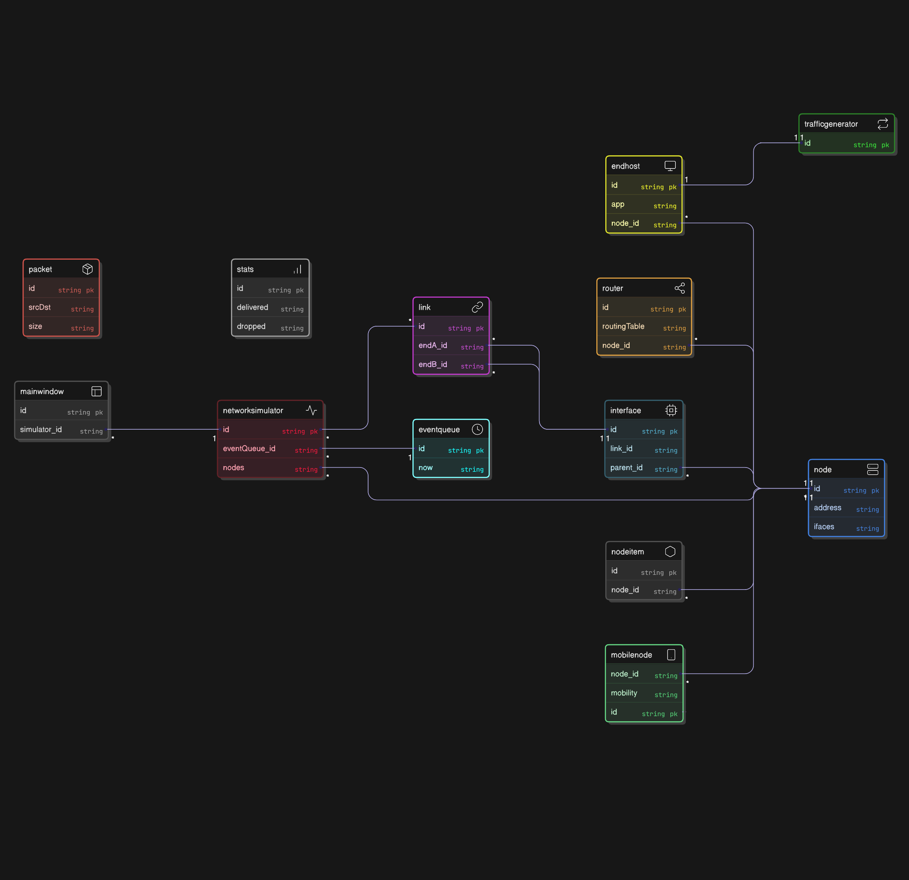

# Network Simulator

**Team:** Oleksii Bulgyn, Leevi Seesjärvi, Oskari Silvoniemi, Eliud Keino  
**Student IDs:** We will provide if needed  
**Date:** 17.10.2025

## 1. Project Overview and Scope

The purpose of this project is to develop a discrete-event network simulator that accurately models the communication and interactions between network nodes and links. Our simulator will provide users with an intuitive and interactive environment for designing and simulating network systems under certain conditions.

The primary goal is to replicate the behavior of real-world data communication systems. The network simulator will generate networks and traffic statistics, allowing users to simulate data transfer and routing in real time. The intended users of the network simulator are networking students and developers who wish to visualize, experiment with, and better understand network performance.

## 2. High-level structure of the software

In the simulator, there are two main components: **nodes** and **links**. Each node will be represented by a `Node` class, containing an address (e.g., `std::string address_`) and methods for sending or receiving packets. Nodes can act as end-hosts, routers or both. Each Node can have an EndHost role and/or a Router role attached to it through composition. End-hosts are responsible for generating and receiving packets through application objects (e.g., `TrafficGenerator`, which is owned by EndHost), while routers forward packets between nodes according to their destination addresses using a routing table. Each Node also contains one or more Interface objects that connect it to Links; interfaces handle the queueing and transmission of packets. Links connect pairs of interfaces rather than nodes directly.

The links connecting these nodes will be modeled by a `Link` class, defined by two main attributes: transmission speed (`double bandwidth_`) and propagation delay (`double delay_`). Because link bandwidth is limited, packets that cannot be immediately transmitted must wait in a queue (e.g., `std::queue<Packet>`), and multiple packets may be in transit on the same link simultaneously. Each Link is associated with two endpoint interfaces (`endA_id` and `endB_id`), enabling bidirectional communication between the connected nodes.

Each packet in the simulation will be an instance of the `Packet` class, containing a combined source–destination identifier (`srcDst`), a unique identifier, and a size in bytes (`size_t size_`), which determines its transmission duration. The simulator will handle events such as sending, forwarding, and receiving packets through an event system managed by a `NetworkSimulator` and `EventQueue` class. The `EventQueue` maintains the current simulation time (`now`) and scheduled events, while the `NetworkSimulator` owns all nodes, links, and statistics components. This ensures that packet timing, propagation delays, and queue processing are all modeled accurately within the simulation timeline.

The system will support flexible configuration of network topologies and simulation parameters using a configuration handler (e.g., `ConfigManager`). Users can define nodes, links, and traffic-generating applications either in code or through configuration files. Adjustable parameters will include link speeds, propagation delays, and packet generation rates, allowing different scenarios to be tested easily. Simulation statistics, such as packet delivery times, link utilization, and queue lengths, will be tracked and reported by `Stats` class, owned by the `NetworkSimulator`, after or during execution.

In addition to the core simulation, the project will include several extended features that improve usability and visualization. A graphical user interface built with Qt will be implemented in a `MainWindow` class to provide a visual view of the network topology. The interface will use `QGraphicsScene` elements such as `NodeItem` to represent nodes and their connections visually to display nodes, links, and animated packet movement across the network. This will allow users to observe traffic flow and queue activity in real time. Different queue behaviors, such as limited-size queues (`LimitedQueue`) that drop packets when full, will also be supported to simulate congestion and packet loss scenarios, adding realism and analytical value to the simulation.

For advanced functionality, a mobile network extension will be implemented using a derived `MobileNode` class that includes 2D coordinates (`QPointF position_`). Each node's communication will be restricted by a signal range variable (`double range_`), allowing only nearby nodes to exchange packets. A separate `Mobility` class defines movement logic and is linked to `MobileNode` via `mobility_id`. A `MobilityModel` component will simulate movement, dynamically updating node positions during runtime. Additional realism can be achieved by introducing obstacles or signal-blocking areas, which affect connectivity and force packets to find alternate routes. This mobile extension provides a foundation for studying dynamic and wireless networks, making the simulator capable of modeling more complex and realistic communication environments.

## 3. Planned use of external libraries

The project will use **Qt** as its only external library. It serves as the foundation for building the graphical user interface. Qt will be responsible for visualizing the network topology, including the nodes, links, and packet flows during the simulation. Through its widget and graphics modules, Qt will allow us to draw a 2D representation of the network and animate events such as packet transmission and queue buildup in real time.

In addition to visualization, Qt will also provide a wide range of basic user interaction components, such as buttons, sliders, and input fields, which will enable users to configure simulation parameters, initiate or halt simulation runs.

Beyond visualization, Qt's event-driven architecture naturally complements the discrete-event logic of the simulator, making it an ideal framework for synchronizing visual updates with simulation steps. At the same time, this integration allows the rest of the project to be implemented in standard C++ without additional external dependencies.

## 4. Sprint Plan

All of the work for each sprint will be done before the end of that particular sprint. We will have two shorter meetings per sprint: one in the beginning and one a few days from the end of the sprint. Additional meetings will be held throughout the project, if needed.

The progress is followed by comparing our issue board to the goals corresponding to the ongoing sprint. Issues that will lead to reaching our goal for the ongoing sprint will be decided at the beginning of that sprint. These issues, and assigning them to each student, will be decided in the meeting at the beginning of the sprint.

| **Sprint**                                          | **Goal Summary**                                                                                                                                                                             |
| --------------------------------------------------- | -------------------------------------------------------------------------------------------------------------------------------------------------------------------------------------------- |
| **Sprint 0: Project setup (29.9 – 10.10)**          | Define and document the overall project scope, structure, and practices, set up the project board, schedules, and an initial plan for libraries and testing framework.                       |
| **Sprint 1: Tools and frameworks (13.10 – 24.10)**  | Establish the development environment by configuring libraries, setting up a working CMake build system, and adding placeholder C++ class templates so the project can compile successfully. |
| **Sprint 2: Initial implementation (27.10 – 7.11)** | Implement the first working features that interact with the user, integrate the chosen libraries, and ensure that core components of the simulator start functioning together.               |
| **Sprint 3: Features complete (10.11 – 21.11)**     | Finalize and integrate all main features of the simulator so that most core functionality is ready and stable, with testing covering most implemented modules.                               |
| **Sprint 4: Finalization (24.11 – 5.12)**           | Complete full testing and documentation of the simulator, fix remaining issues, and ensure the codebase, documentation, and tests are all ready for final delivery.                          |
| **Final Demos (8.12 – 12.12)**                      | Present the finished simulator, demonstrating its functionality, performance, and documented results.                                                                                        |

## 5. Class Diagram

The diagram emphasizes the relationships rather than implementation details, showing how the simulator's logic, communication, and visualization layers interact. For this reason, the classes do not include every member variable and method. After team discussions and manual sketches of the class relationships, the final UML diagram was created using an AI-assisted diagramming tool for clarity and consistency.
